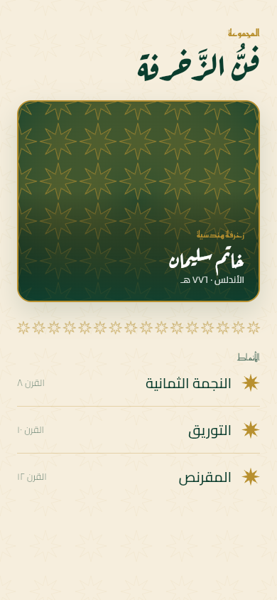
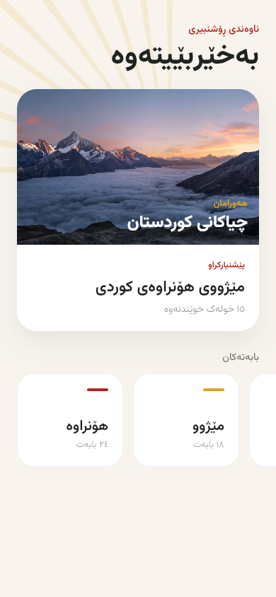
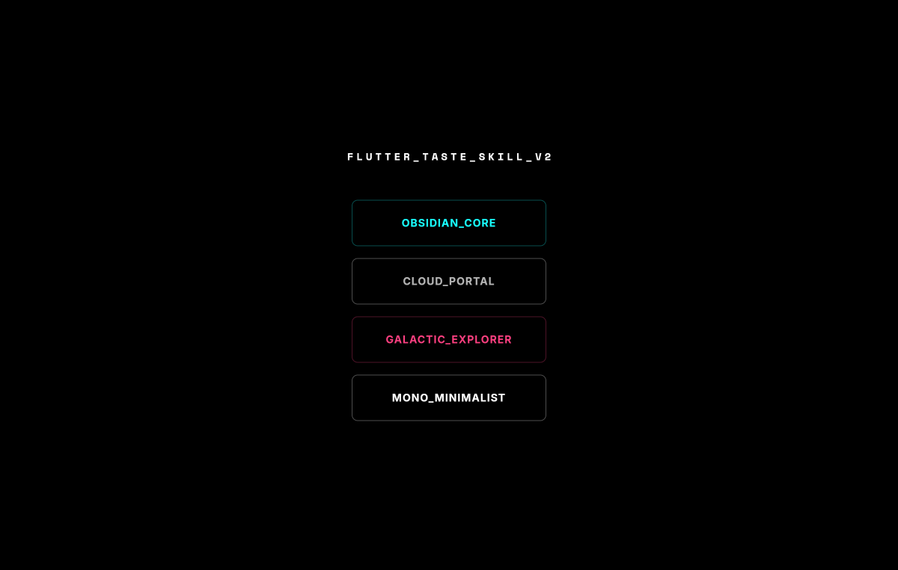
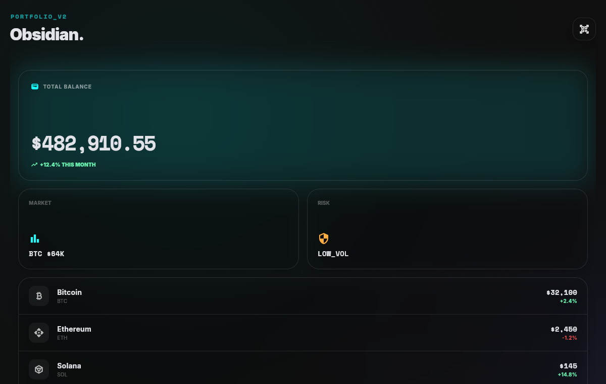
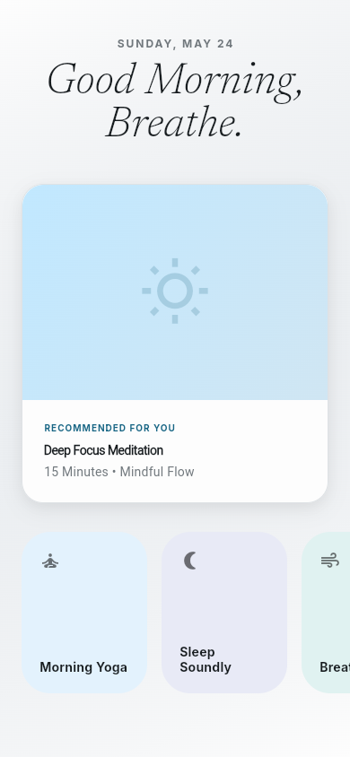
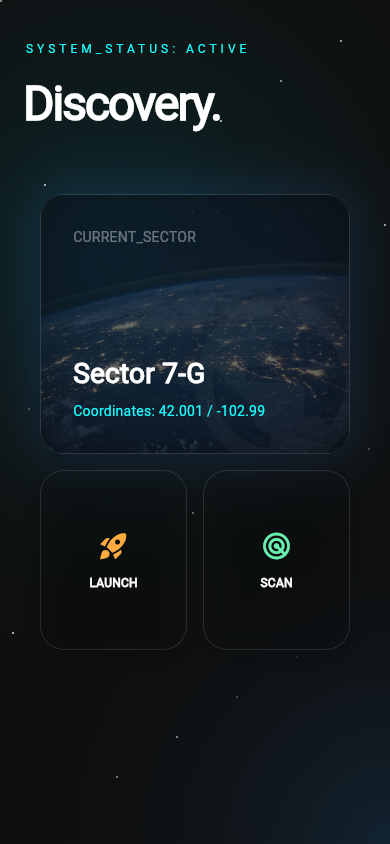
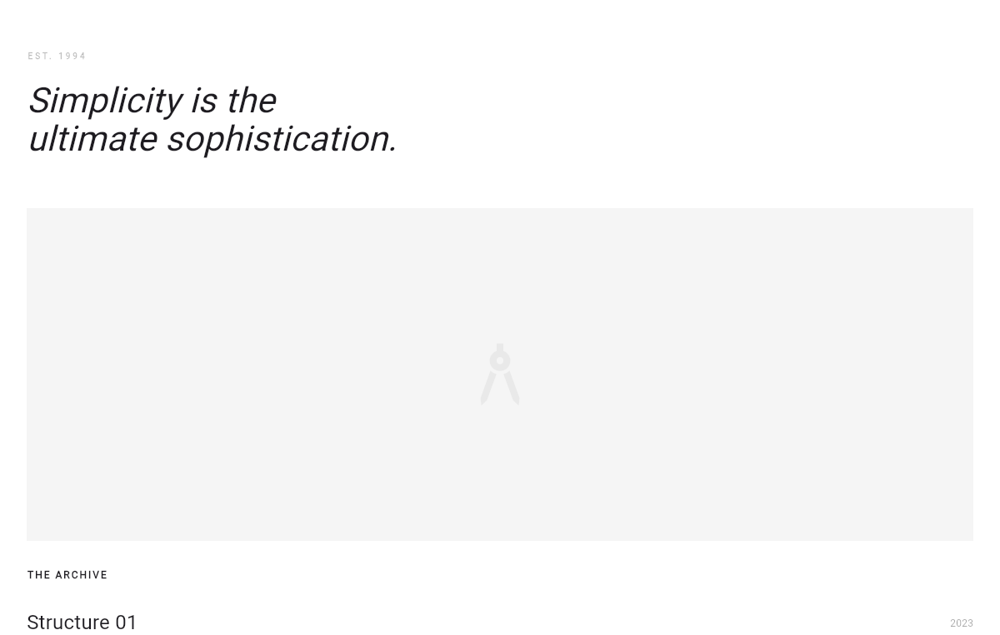

# Flutter Taste Skill 🦋

> **"Give your Flutter AI good taste."**

Inspired by the groundbreaking [taste-skill](https://github.com/Leonxlnx/taste-skill) by Leonxlnx, this project adapts the "v2" design philosophy for the Flutter and mobile ecosystem. It is designed to stop AI agents from generating "Material Slop" and start creating high-fidelity, premium mobile products.

## 🌍 Trilingual by design (LTR · Arabic · Sorani Kurdish)

Taste is not only English. The showcase ships fully **right-to-left** Arabic and Kurdish Sorani screens with script-aware fonts (Aref Ruqaa / Reem Kufi / Cairo for Arabic, Vazirmatn for Sorani), native Eastern-Arabic numerals, and traditional ornament drawn in code:

| Arabesque Atelier · Arabic | Sorani Modern · Kurdish |
| :---: | :---: |
|  |  |

All six variants are in [Examples](#-examples) below.

## 🚀 Quick Start

### 1. Installation

#### **One command (recommended) — works across 18+ agents:**
This repo is a spec-compliant [Agent Skill](https://skills.sh). Install it into
Claude Code, Cursor, Gemini CLI, Codex, GitHub Copilot, Windsurf, Cline, and
more with the [Vercel `skills` CLI](https://skills.sh):
```bash
npx skills add hooshyar/flutter-taste-skill
```

#### **Cursor (project rule):**
Copy `rules/flutter-taste.mdc` into your project's `.cursor/rules/` directory.

#### **Any agent (manual):**
Add the contents of `SKILL.md` to your system prompt or project instructions.

#### **As a Flutter dependency (optional reference widgets):**
```yaml
dependencies:
  flutter_taste_skill:
    git:
      url: https://github.com/hooshyar/flutter-taste-skill.git
```

### 2. Usage

**The simple way: just ask.** Once installed via `npx skills add`, the skill
activates automatically when you ask your agent to build or restyle Flutter UI.
It self-describes when to apply, so you usually invoke nothing:

> "Build a crypto portfolio screen in Flutter."

**Steer it.** Set the **Three Dials** (each 1-10) and pick an **Aesthetic
Variant** to control the output:

> "Build a profile screen. `FLUTTER_LAYOUT_VARIANCE: 7`, `FLUTTER_MOTION: 5`, `FLUTTER_DENSITY: 3`. Variant: Cloud."

**Arabic / Kurdish Sorani.** Just say so; the skill applies its RTL and
script-aware rules (fonts, numerals, direction):

> "Build an Arabic reading screen, right-to-left, traditional."

> "Build a Kurdish Sorani news feed, modern and clean."

**Manual install?** If you pasted `SKILL.md` instead of using the CLI, keep that
content in your system prompt or project rules so it stays in context.

## 🎛️ The v2 System
This implementation follows the **Taste-Skill v2** architecture:

- **Section 0 (Design Read):** The AI must audit the context before coding.
- **The Three Dials:** Parametric control over Variance, Motion, and Density.
- **Anti-Slop Ban List:** Strict enforcement of quality (No em-dashes, no AI-purple, no repeated layouts).
- **Hard Pre-flight Check:** A checklist the AI must follow before final output.

## 📦 What's Inside?
- `SKILL.md`: The core v2 instruction set for AI agents.
- `lib/src/components/`: Reference "Tasteful" widgets (Card, BentoGrid, GlassContainer).
- `lib/src/theme/`: `TasteTheme` utility for premium Material 3 palettes.
- `GEMINI.md`: Specific instructions for the Gemini CLI agent.

## 🦋 Aesthetic Variants
The four showcase screens each embody one direction (see [Examples](#-examples) below):
- **Obsidian:** Pro-grade dark mode, glassmorphism, high contrast (fintech / crypto).
- **Cloud:** Editorial soft mode, serif display type, massive whitespace (wellness / lifestyle).
- **Galactic:** Sci-fi deep space, nebula mesh gradients, glowing glass bento.
- **Mono Minimalist:** Brutalist-leaning editorial, stark light canvas, monospace labels.

## 📸 Examples

The showcase app (`lib/main.dart`) ships four fully realized screens, one per
aesthetic direction. Screenshots below are captured from the live web build at
a phone viewport. Photography via [Unsplash](https://unsplash.com); each image
degrades gracefully to a gradient placeholder when offline.

| Showcase selector |
| :---: |
|  |

### Obsidian Core
Fintech / crypto pro. Dark glassmorphism, cyan accent, bento layout.



### Cloud Portal
Editorial soft mode. Serif display type, pastel cells, generous whitespace.



### Galactic Explorer
Sci-fi / deep space. Nebula mesh gradient (teal + blue + magenta, no lazy
indigo-purple), glowing glass bento, drifting star particles.



### Mono Minimalist
Brutalist-leaning editorial. Stark light canvas, oversized italic headline,
monospace labels.



### Arabesque Atelier (Arabic, RTL)
Traditional Arabic heritage. Cream + emerald + gold, a hand-drawn 8-point-star
(khatam) geometric field, calligraphic display (Aref Ruqaa), geometric Kufi
labels (Reem Kufi), Naskh body (Cairo). Fully right-to-left.


### Sorani Modern (Kurdish, RTL)
Contemporary Kurdish reading app. Warm sand canvas, a Kurdish sun-ray motif, a
single deep-red accent, real mountain photography, and Vazirmatn throughout for
full Sorani glyph coverage (Estedad / Lalezar are drop-in swaps). Right-to-left.


---
*Created by [Hooshyar](https://github.com/hooshyar) • Inspired by [Leonxlnx](https://github.com/Leonxlnx)*
